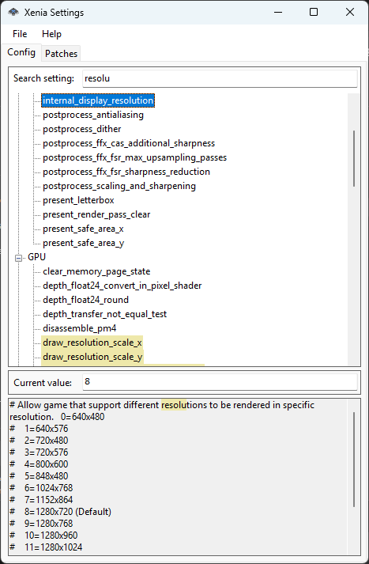
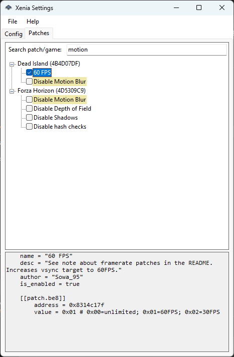

# Xenia Settings

A lightweight Windows UI for configuring **Xenia Canary**, the Xbox 360 emulator. Edit emulator settings and toggle game patches without opening TOML files in a text editor.

## Features

- **Config:** browse settings by section, search names and descriptions, and edit values.
- **Patches:** browse games and their patches, toggle or edit individual patches, and search by game name, title ID, patch name, or patch contents.
- View the original game metadata and complete patch contents, including nested write tables.
- Save changes while preserving comments, formatting, encoding, and line endings.
- Detect external file changes before saving and keep pending edits in memory if saving fails.
- Use Patches even when the emulator config is unavailable.

## Screenshots

| Config | Patches |
| --- | --- |
|  |  |

## Getting started

Requires **Windows** and **.NET Framework 4.7.2 or later**.

1. Download `xenia-settings-windows.zip` from [Latest Build](https://github.com/auwaho/xenia-settings/releases/tag/latest-build) and extract it, or build the application using the instructions below.
2. Copy `xenia_settings.exe` into your Xenia Canary folder.
3. Run `xenia_settings.exe`.

The application reads the existing config and patch files next to its executable:

```text
xenia/
├── xenia_canary.exe
├── xenia_settings.exe
├── xenia-canary.config.toml
└── patches/
    ├── Game.patch.toml
    └── Another Game.patch.toml
```

The window title shows **Unsaved changes** while either tab has pending edits. Press **Ctrl+S** to save the currently open tab: Config saves the config file; Patches saves patch changes, including edited text. Saving one tab keeps the indicator visible if the other still has unsaved changes. Failed saves retain both the edits and the indicator.

### Config

Select a setting and edit **Value**. Changes stay in memory until you choose **File → Save config**. Saving replaces only changed values in the original file.

**File → Reload config** loads the file again and discards pending config edits after a successful load. If loading fails, the previous settings and pending edits remain available. If the config is missing at startup, restore it and choose **Reload config** to enable the Config tab.

Quoted values use a text field without the surrounding quotes. Values `true` and `false` use a dropdown with those two choices; other values use a numeric input. Fractional numbers retain decimal places. Quotes are added automatically when saving strings.

### Patches

Expand a game to see its patch checkboxes. Select a game to view the file header before the first `[[patch]]`, or select a patch to view its complete contents.

Right-click a patch and choose **Edit...** to enable editing in the description area. Edit its text, including `value`, addresses, or comments. Pending text stays available when switching patches or tabs; other patches and game metadata open read-only.

Checkbox and text changes stay in memory until you choose **File → Save patches**. Saving applies text edits and updates patch names and checkboxes, then returns the description to read-only mode. The game header and untouched patches retain their original text. Basic patch metadata and table headers are checked when saving; individual write values are edited as text. If saving fails, pending edits remain available.

**File → Reload patches** reloads the folder and discards pending patch edits.

If a file changes outside the application, saving that file is blocked with an error message. Reload it before editing again. A missing `patches` folder produces an empty tree; unreadable patch files are reported while other files remain available.

## Building

Install Visual Studio with the **.NET desktop development** workload and the **.NET Framework 4.7.2 targeting pack**. Open `XeniaSettings.sln` and build **Release / Any CPU**, or run the following in a Developer PowerShell terminal:

```powershell
msbuild XeniaSettings.sln /t:Build /p:Configuration=Release '/p:Platform=Any CPU'
```

Build output: `XeniaSettings/bin/Release/`.

The build copies sample files from `XeniaSettings/TestData` into the output folder, preserving the `patches` subfolder. When installing the application, copy the application files into your emulator folder and keep your existing emulator config and patches.

## Regression checks

The test runner references the built application and requires no additional test packages. Both projects are included in the solution:

```powershell
msbuild Tests/XeniaSettings.Tests.csproj /t:Build /p:Configuration=Release /p:Platform=AnyCPU
./Tests/bin/Release/XeniaSettings.Tests.exe
```

To also check an existing emulator patch collection and its neighboring config without modifying either, pass the patch folder:

```powershell
./Tests/bin/Release/XeniaSettings.Tests.exe 'C:\Path\To\Xenia\patches'
```

Tests modify only copied fixtures in their own output folder. Rebuild the test project before another run to restore its fixtures.

GitHub Actions builds and runs regression checks for **Release / Any CPU** and **Debug / x64** on Windows. The Release job also checks packaging and publication recovery without making GitHub API calls.

After both builds pass for a push to `main`, the workflow updates one **Latest Build** release and its `latest-build` tag to the tested commit. The ZIP contains only `xenia_settings.exe` and `LICENSE`. Pull requests, pushes to other branches, and manual workflow runs only run checks. Older builds are skipped if `main` has moved on. An interrupted publication remains a draft; rerunning the release job retries it.

To run the release workflow checks locally after a Release build:

```powershell
./Tests/ReleaseWorkflowTests.ps1
```

## License

MIT. See [LICENSE](LICENSE).
